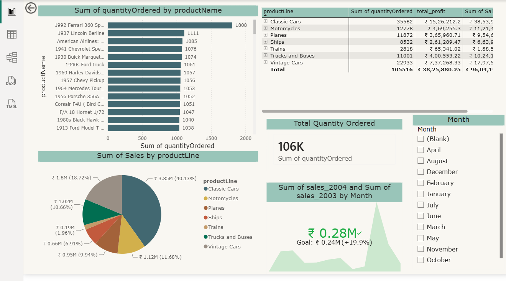
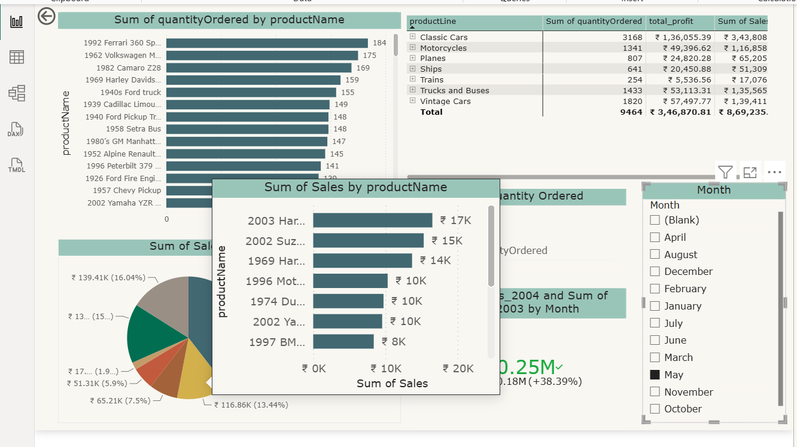
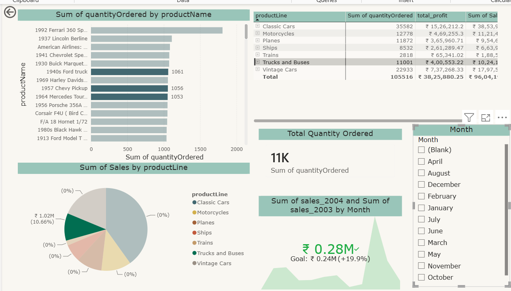

# Dynamic Sales Dashboard using Power BI

## Overview
An interactive Power BI dashboard built on sales data to analyze:

- Product performance
- Quantity ordered
- Revenue trends
- Profit analysis
- Monthly sales trends

## Features

✅ Dynamic slicers

✅ Cross filtering

✅ Custom tooltip pages

✅ KPI Cards

✅ Interactive Pie Charts

✅ Matrix reports

## Dashboard Preview

## Insights

- Classic Cars generated the highest sales.
- Product demand varies significantly by month.
- Profit contribution differs across product lines.

## Tools Used

- Power BI
- Power Query
- DAX
- Data Modeling

## Files

- Sales_Dashboard.pbix
- Screenshots
